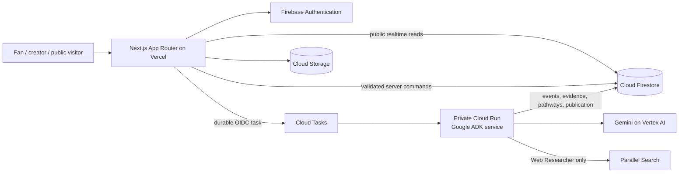

# Audience Take

> The audience's take on what should be made next.

Audience Take is a social scouting platform for overlooked screen projects. Fans and creators nominate a public project URL; a durable Google ADK workflow researches the project with Gemini and Parallel; and the resulting evidence becomes a cited, shareable **Scout Card** with three realistic development pathways.

The product is being built for the **Agentic Cinema Hackathon — Parallel track**. Its core idea is simple: audience enthusiasm becomes more useful when it is connected to traceable evidence, honest limitations, and a concrete next experiment.

## Current status

Audience Take is an active hackathon build, not a finished production service.

| Area | Status |
|---|---|
| Application foundation and shared contracts | Complete |
| Firebase identity, rules, and local emulation | Complete |
| Landing page and nomination experience | Complete |
| Nomination persistence and canonical deduplication | Complete |
| Durable research runtime, agent pipeline, and Scout Card | Complete through the approved live research run |
| Native social layer and Scout Profiles | Implemented locally; deployment pending |
| Suggest Evidence, creator claims/updates, reports, and trust controls | Implemented locally; deployment pending |
| Final production hardening and judge rehearsal | In progress |
| Public web application | Not yet published |
| Open-source license | Not yet selected; all rights reserved for now |

The repository intentionally does not claim a successful end-to-end public Scout Card until the deployed workflow has completed its remaining validation and visual approval gates. See the [build checklist](docs/hackathon-build/checklist.md) for the authoritative progress contract.

## What Audience Take does

1. A fan or creator submits a public project URL and explains why the work deserves a wider future.
2. The server validates and canonicalizes the source, deduplicates repeat nominations, and creates a durable research run.
3. A private Cloud Run worker uses Google ADK and Gemini to analyze the source, plan current-web research, qualify evidence, and form development pathways.
4. The Web Researcher makes the workflow's single bounded Parallel Search call and preserves source provenance.
5. The application publishes a complete or honestly partial Scout Card only after deterministic contract checks pass.
6. The finished card becomes a social object: people can inspect citations, compare pathways, follow the project, make commitments, and publish structured Takes.
7. Signed-in scouts can submit public evidence leads, creators can request project-scoped access, and reports/corrections retain separate audit histories.

## The Scout Card

The Scout Card is the canonical public object for a project. It is designed to answer two questions at different levels of depth:

- **Why should I care?** A bold editorial summary presents the project, its hook, provenance, current format, and strongest supported signals.
- **What deserves human follow-up?** The expandable Industry Lens shows evidence quality, citations, comparables, risks, assumptions, unresolved questions, and three possible pathways.

Audience Take does not produce a composite “greenlight score.” It keeps evidence, external commentary, and native Audience Take activity separate so readers can interpret the underlying signals themselves.

### Social, evidence, and creator trust lanes

- Native Follow, commitment, pathway-vote, Take, and reply commands use deterministic IDs and Firestore transactions so retries do not inflate counters.
- Pre-approved demo-account activity carries a visible `Demo activity` label and writes to separate demo counters, so it never inflates organic participation totals.
- Supporting nomination links and post-card suggestions enter a separate `community_lead` queue. They cannot affect claims, pathways, or confidence before human review.
- Evidence review has five explicit outcomes. Verified incorporation creates or links a normalized source with Community Lead provenance; reviewer details remain server-private.
- Request to Claim is a real pending workflow. Approval updates only server-private project-scoped role assignments; a creator-mode nomination never grants access by itself.
- Approved creators can publish, edit, withdraw, and attach validated raster media only through trusted server routes. They cannot rewrite agent evidence, citations, nominations, social history, or corrections.
- Reports never auto-hide content. Reporters can follow open, reviewing, resolved, or dismissed case status while raw context and moderator notes remain private.
- Material corrections append a public update-history row while retaining a private actor audit and the prior card basis.
- Per-account burst and daily limits protect evidence, claims, uploads, reports, Takes, replies, and creator updates. Rate-limit keys are hashed and server-only; upload request IDs make safe retries reuse the same media record and object path.

## Research pipeline

Every run advances through six visible, durable stages:

| Stage | Owner | Durable result |
|---|---|---|
| 1. Reading the source | Source Analyst | Source identity, medium, synopsis, and initial questions |
| 2. Mapping story and creator context | Source Analyst | Storyworld, format, creator context, and claims needing verification |
| 3. Searching the public web | Web Researcher + Parallel | Bounded queries, normalized public sources, and a safe tool receipt |
| 4. Checking evidence and comparables | Evidence Editor | Qualified claims, comparables, limitations, and unresolved questions |
| 5. Building three pathways | Pathway Strategist | Distinct pathways with evidence, risks, confidence, and next experiments |
| 6. Publishing the Scout Card | Orchestrator | Contract-validated atomic publication or an honest partial/failed outcome |

Stage outputs are versioned in Firestore. A browser can close or refresh without becoming the workflow's execution host, and a later safe attempt can reuse already completed stages rather than repeating paid provider work.

## Architecture



### Runtime boundaries

- The browser never receives Gemini, Parallel, service-account, or Firebase Admin credentials.
- Consequential writes cross authenticated Next.js server routes with ID-token, App Check, schema, permission, and state validation.
- Cloud Tasks invokes the research service with a dedicated OIDC identity; the Cloud Run endpoint is private by IAM.
- Only the Web Researcher owns the Parallel tool.
- Canonical JSON Schemas keep TypeScript and Python payloads aligned.
- Structured public receipts expose stage status, tools, safe query labels, source counts, and outcomes—not hidden model reasoning.

## Technology

| Layer | Technology |
|---|---|
| Web | Next.js 16, React 19, TypeScript, App Router |
| Web hosting | Vercel with GitHub-based production deploys |
| Authentication and data | Firebase Authentication, Cloud Firestore, Cloud Storage |
| Durable execution | Google Cloud Tasks and Cloud Run |
| Agent runtime | Python 3.12, Google ADK, Pydantic |
| Model | Gemini on Vertex AI |
| Current-web research | Parallel Search API |
| Infrastructure | Terraform and Google Cloud IAM |
| Testing | Vitest, Testing Library, Firebase Rules Unit Testing, Pytest, Ruff, mypy |

## Repository layout

```text
audience-take/
├── apps/web/                 # Next.js application and trusted command routes
├── services/agents/          # Python ADK research service and tests
├── contracts/                # Canonical JSON Schemas and cross-runtime fixtures
├── firebase/                 # Firestore/Storage rules, indexes, and demo seed data
├── infra/                    # Terraform and deployment documentation
├── tests/e2e/                # Critical judge-journey coverage
├── docs/hackathon-build/     # Scope, PRD, specification, checklist, and build notes
└── .env.example              # Configuration names only—never real credentials
```

## Prerequisites

- Node.js 22 or newer
- npm
- Python 3.12
- [`uv`](https://docs.astral.sh/uv/)
- Java for the Firebase Emulator Suite
- Firebase CLI
- Google Cloud CLI and Terraform only for reviewed cloud deployment work

## Quick start

```bash
git clone https://github.com/tmoody1973/audiencetake.git
cd audiencetake
cp .env.example apps/web/.env.local
npm install
uv sync --frozen --project services/agents
```

Populate `apps/web/.env.local` with development Firebase values. Keep emulator mode enabled for local work:

```dotenv
NEXT_PUBLIC_USE_FIREBASE_EMULATORS=true
APP_CHECK_ENFORCEMENT_ENABLED=false
NEXT_PUBLIC_APP_URL=http://localhost:3000
```

Start the Firebase emulators in one terminal and the web application in another:

```bash
npm run emulators:start
npm run dev
```

To load the clearly labeled local demo profiles into a temporary emulator:

```bash
npm run emulators:seed-demo
```

The seeder refuses to target a non-emulated project unless an operator deliberately enables the protected demo override. Never commit an `.env.local` file, service-account JSON, provider keys, or exported credentials.

## Commands

| Command | Purpose |
|---|---|
| `npm run dev` | Start the Next.js development server |
| `npm run build` | Create a production web build |
| `npm run lint` | Run web ESLint checks |
| `npm run typecheck` | Run strict TypeScript checking |
| `npm run test` | Run web unit and component tests |
| `npm run test:contracts` | Validate shared fixtures against canonical schemas |
| `npm run test:python` | Run the Python agent/runtime suite |
| `npm run test:emulators` | Run Firestore/Auth/Storage rules tests in the emulator suite |
| `npm run check` | Run lint, typecheck, contract tests, and web tests |

Run the standard local gate before committing:

```bash
npm run check
npm run test:python
npm run test:emulators
```

The deployed Gemini/Parallel smoke run is intentionally separate. It is a controlled, explicitly authorized operation because it invokes paid providers and cloud resources.

## Environment configuration

The checked-in [.env.example](.env.example) contains names and safe local defaults only. Configuration is grouped by boundary:

- `NEXT_PUBLIC_FIREBASE_*` — public Firebase client configuration.
- `GOOGLE_CLOUD_*` and `AUDIENCE_TAKE_GEMINI_MODEL` — server-side project, location, and pinned model selection.
- `GOOGLE_SERVICE_ACCOUNT_JSON` — encrypted server-only credential for hosts
  without Application Default Credentials; never expose it through a
  `NEXT_PUBLIC_` variable.
- `CLOUD_TASKS_*` and `AGENT_SERVICE_*` — queue and private Cloud Run routing.
- `PARALLEL_API_KEY_SECRET` — Secret Manager reference, never the Parallel key value.
- `APP_CHECK_ENFORCEMENT_ENABLED` — disabled only for local emulator work; production command routes enforce App Check.
- `DEMO_FALLBACK_ENABLED` — when enabled, fallback content must retain its visible “Previously generated — live refresh unavailable” label.

Google Cloud workloads use workload identity or Application Default
Credentials. The Vercel web runtime uses a dedicated least-privilege service
account stored as the encrypted `GOOGLE_SERVICE_ACCOUNT_JSON` project secret.
Do not add downloaded service-account keys to the repository or local env files.

### Vercel deployment

Import the public GitHub repository as a Next.js project and set its Root
Directory to `apps/web`. Production keeps Firebase Authentication, Firestore,
Storage, App Check, Cloud Tasks, and the private Cloud Run research service; only
the web host changes.

Copy the public and server configuration names from `.env.example` into Vercel.
Set `NEXT_PUBLIC_APP_URL` to the final production URL, keep
`APP_CHECK_ENFORCEMENT_ENABLED=true`, and store `GOOGLE_SERVICE_ACCOUNT_JSON` as
an encrypted server-only value. Add the production domain to Firebase Auth's
authorized domains and the reCAPTCHA Enterprise/App Check domain allowlist
before exercising authenticated commands.

Vercel Functions have a 4.5 MB request-body limit. The current trusted
server-mediated creator upload is capped at 4 MB, including separate multipart
headroom. A later direct-to-Firebase-Storage flow must use a short-lived grant
plus server-side finalize validation; a raw public write is not an acceptable
substitute.

## Contracts and truth rules

The files in [contracts/schemas](contracts/schemas) are the cross-runtime source of truth. Representative fixtures must validate identically in TypeScript and Python.

The publication boundary adds stricter semantic rules that JSON shape alone cannot guarantee:

- Every substantive claim references an exact known source ID.
- Search results are leads until the Evidence Editor qualifies their relationship to a claim.
- External comments and crowdfunding activity never become native Audience Take counts.
- Named platforms, studios, or distributors are not described as interested without direct evidence.
- Fixed project, run, pathway identity, and policy values are injected deterministically rather than invented by a model.
- Useful incomplete research may publish only as an explicitly labeled Partial Scout Card.

## Security and responsible AI

- Public URLs are normalized and read through bounded SSRF protections, redirect checks, and response-size limits.
- Direct browser writes to trusted research, evidence, publication, counter, claim, and moderation collections are denied.
- Public suggestion, report, creator-update, and correction projections exclude reviewer identities, ownership UIDs, raw report context, and private authorization records.
- Creator uploads accept only bounded JPEG, PNG, or WebP payloads whose declared MIME matches their magic bytes; object paths and extensions are generated by the server.
- Task names, leases, run versions, and stage outputs make duplicate delivery idempotent.
- Provider prompts, raw model text, authorization headers, secret values, and chain-of-thought are excluded from public events and safe failure logs.
- Source provenance survives normalization so submitted links are never mislabeled as Parallel discoveries.
- Demo and seeded activity remains visibly labeled.
- The product presents research assistance, not investment advice, acquisition probability, or a claim of commercial certainty.

See the [technical specification](docs/hackathon-build/spec.md) and [infrastructure guide](infra/README.md) for the full authorization and runtime model.

## Demonstration project

Junichiro Jackson is the primary demonstration project. It must remain labeled **Fan nomination — unclaimed by creator** unless a separately identified pre-approved creator state is being demonstrated.

Its three approved scouting directions are:

1. Premium adult animated series.
2. Independent animated feature.
3. Creator-direct serialized franchise combining animation and publishing.

Supporting sources are treated precisely. For example, the verified JJ Kickstarter is evidence of the psychological-thriller manga and wider project universe; it is not presented as proof of film financing.

## Planning and project documentation

- [Hackathon scope](docs/hackathon-build/scope.md)
- [Product requirements](docs/hackathon-build/prd.md)
- [Technical specification](docs/hackathon-build/spec.md)
- [Build checklist](docs/hackathon-build/checklist.md)
- [Guided build notes](docs/hackathon-build/build-notes.md)
- [Shared contract guide](contracts/README.md)
- [Infrastructure guide](infra/README.md)
- [End-to-end testing guide](tests/e2e/README.md)

The checklist is the implementation contract. Optional Slate View or Grafana work remains gated until the complete public judge journey passes.

## Contributing

Audience Take is currently moving through a tightly sequenced hackathon build. Before opening a change:

1. Read the PRD, specification, and current checklist item.
2. Keep changes inside this repository and avoid committing credentials or unrelated workspace files.
3. Preserve the canonical JSON Schemas and add cross-runtime fixtures for contract changes.
4. Add focused tests for authorization, provenance, recovery, and public failure behavior.
5. Run the local verification gate above.
6. Describe what is live, simulated, partial, seeded, or deferred without blurring those states.

## License

An open-source license will be selected before public hackathon submission. Until a `LICENSE` file is committed, all rights are reserved.
