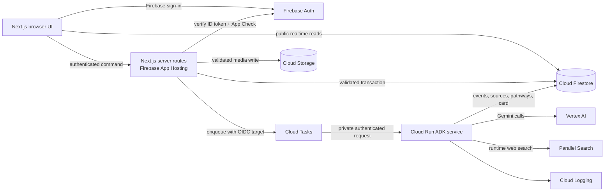

# Audience Take — Technical Specification

Status: Approved architecture ready for implementation  
Hackathon: Agentic Cinema — Parallel track  
Primary demo project: Junichiro Jackson  
Last updated: 2026-08-26

## Overview

Audience Take is a public social-scouting application for overlooked screen projects. A fan or creator submits a public project URL. A durable background research run uses Google ADK, Gemini on Vertex AI, and Parallel Search to create an evidence-backed Scout Card. The finished card gives the public meaningful ways to follow and champion the project while giving creators and industry professionals a sober Industry Lens.

The implementation must optimize for two outcomes at the same time:

1. A three-minute hackathon demonstration that visibly proves live Gemini, Google Cloud, and Parallel use.
2. A credible product foundation whose provenance, permissions, and social data can survive beyond a staged demo.

This specification implements the approved requirements in `prd.md`. When the documents differ, the PRD controls product behavior and this specification controls implementation details.

## Technical Principles

1. **The Scout Card is the canonical public object.** Research, pathways, native social actions, creator status, and the Industry Lens converge on one project record.
2. **Research is durable.** A run continues if the browser closes or refreshes, and its state is recoverable from Firestore.
3. **Receipts, not hidden reasoning.** The interface exposes stage status, queries, tools, source counts, and concise outcomes. It never exposes private chain-of-thought or raw model scratch work.
4. **Evidence and community opinion remain distinct.** Parallel results, submitted sources, external commentary, Audience Take commitments, and Takes have different types and labels.
5. **Partial truth beats synthetic completeness.** Useful evidence can publish as a Partial Scout Card with explicit omissions and retry controls.
6. **Writes cross a trusted boundary.** Browsers may subscribe to published Firestore data, but consequential writes are authenticated and validated by server endpoints.
7. **The live path has a labeled fallback.** The demo performs a real Parallel call; if the full live refresh fails, a previously generated Junichiro card may appear only with the label “Previously generated — live refresh unavailable.”
8. **No composite greenlight score.** Audience Take displays interpretable counts, evidence, limitations, and pathway confidence rather than claiming to predict commercial success.

## Stack

| Layer | Technology | Responsibility |
|---|---|---|
| Web application | Next.js App Router + TypeScript | Public experience, authenticated actions, server endpoints, metadata, and shareable pages |
| Visual system | Neobrutalism.com Pro primitives plus product-specific components | Film-festival/underground-magazine public UI and calmer Industry Lens |
| Authentication | Firebase Authentication | Google and email-based sign-in; stable Firebase UID |
| Public/realtime data | Cloud Firestore | Projects, research progress, sources, pathways, social data, claims, and moderation states |
| Media | Cloud Storage for Firebase | Approved images, avatars, creator update media, and fallback artwork |
| Hosting | Firebase App Hosting | Public Next.js deployment and server route handlers |
| Task queue | Google Cloud Tasks | Durable, retryable invocation of research work |
| Agent runtime | Private Cloud Run service | Runs the ADK pipeline and writes trusted research results |
| Agent framework | Google Agent Development Kit for Python | Four-agent orchestration, tools, state, and structured outputs |
| Model | Gemini on Vertex AI | Source analysis, evidence synthesis, and pathway reasoning |
| Partner integration | Parallel Search API | Runtime search of the current public web with cited result URLs and excerpts |
| Secrets | Google Cloud Secret Manager | Parallel key and other server-only configuration |
| Optional observability | Structured Cloud Logging; Grafana only after core stability | Run debugging and optional supporting agent trace views |
| Web testing | Component/route tests, Firebase Emulator Suite, Playwright | Unit, authorization/rules, integration, and critical demo journey coverage |
| Agent testing | Pytest with recorded fixtures plus one deployed smoke test | Agent contracts, tools, recovery, and live integration proof |

## System Architecture



### Runtime boundaries

- The browser never receives Gemini, Parallel, Google Cloud service-account, or Admin SDK credentials.
- Firebase client libraries handle sign-in and realtime public reads.
- Next.js route handlers verify the Firebase ID token, App Check token, request body, permissions, and rate limits before using the Firebase Admin SDK.
- The Cloud Run service requires IAM authentication. Only the configured Cloud Tasks service account may invoke its task endpoint.
- Only the Web Researcher agent may call Parallel. Every result is normalized into a source record before later agents can use it.
- Research writes include `runId`, `attempt`, model/tool metadata, and timestamps so a card can be audited and retried.

## Repository And File Structure

Audience Take will live in an isolated directory because the current workspace root contains an unrelated application.

```text
audience-take/
├── apps/
│   └── web/
│       ├── app/
│       │   ├── (public)/
│       │   │   ├── page.tsx
│       │   │   ├── nominate/page.tsx
│       │   │   ├── research/[runId]/page.tsx
│       │   │   ├── projects/[slug]/page.tsx
│       │   │   ├── selects/page.tsx
│       │   │   └── scouts/[handle]/page.tsx
│       │   ├── (auth)/sign-in/page.tsx
│       │   ├── (account)/me/page.tsx
│       │   ├── (account)/claims/[claimId]/page.tsx
│       │   ├── (account)/projects/[slug]/manage/page.tsx
│       │   └── api/
│       │       ├── auth/profile/route.ts
│       │       ├── nominations/route.ts
│       │       ├── research-runs/[runId]/retry/route.ts
│       │       ├── projects/[projectId]/follow/route.ts
│       │       ├── projects/[projectId]/commitments/[type]/route.ts
│       │       ├── projects/[projectId]/pathway-vote/route.ts
│       │       ├── projects/[projectId]/take/route.ts
│       │       ├── takes/[takeId]/reply/route.ts
│       │       ├── projects/[projectId]/evidence-suggestions/route.ts
│       │       ├── projects/[projectId]/claim-requests/route.ts
│       │       ├── projects/[projectId]/creator-updates/route.ts
│       │       ├── uploads/route.ts
│       │       └── reports/route.ts
│       ├── components/
│       │   ├── primitives/
│       │   ├── navigation/
│       │   └── feedback/
│       ├── features/
│       │   ├── landing/
│       │   ├── nomination/
│       │   ├── research-progress/
│       │   ├── scout-card/
│       │   ├── industry-lens/
│       │   ├── social/
│       │   ├── evidence/
│       │   ├── claims/
│       │   ├── profiles/
│       │   ├── selects/
│       │   └── trust/
│       ├── lib/
│       │   ├── auth/
│       │   ├── firebase/
│       │   ├── validation/
│       │   ├── rate-limit/
│       │   └── telemetry/
│       └── tests/
├── services/
│   └── agents/
│       ├── src/audience_take_agents/
│       │   ├── app.py
│       │   ├── orchestrator.py
│       │   ├── agents/
│       │   │   ├── source_analyst.py
│       │   │   ├── web_researcher.py
│       │   │   ├── evidence_editor.py
│       │   │   └── pathway_strategist.py
│       │   ├── tools/
│       │   │   ├── parallel_search.py
│       │   │   ├── source_reader.py
│       │   │   └── firestore_writer.py
│       │   ├── contracts/
│       │   ├── prompts/
│       │   └── settings.py
│       ├── tests/
│       ├── Dockerfile
│       └── pyproject.toml
├── contracts/
│   ├── schemas/
│   │   ├── nomination.schema.json
│   │   ├── source.schema.json
│   │   ├── evidence-claim.schema.json
│   │   ├── pathway.schema.json
│   │   ├── scout-card.schema.json
│   │   └── research-event.schema.json
│   ├── fixtures/
│   └── README.md
├── firebase/
│   ├── firestore.rules
│   ├── firestore.indexes.json
│   ├── storage.rules
│   └── seed/
│       ├── junichiro-jackson.json
│       └── demo-accounts.example.json
├── infra/
│   ├── cloud-run/
│   ├── cloud-tasks/
│   ├── iam/
│   └── README.md
├── tests/
│   └── e2e/
├── docs/
│   ├── architecture.md
│   ├── demo-runbook.md
│   └── data-policy.md
├── .env.example
├── firebase.json
├── package.json
└── README.md
```

### Shared contract rule

JSON Schema files in `contracts/schemas/` are the canonical cross-runtime contracts. TypeScript and Python may generate or wrap native types, but neither side may silently add incompatible fields. CI validates representative fixtures against the schemas and fails when generated/native types drift.

## Screen And Route Specification

### `/` — Landing page

Implements: `prd.md > Epic 1.1`, `prd.md > Epic 10.1`

- Mission hero: “The audience’s take on what should be made next.”
- High-contrast nomination module above the fold with one obvious URL field and submit action.
- Featured Junichiro Scout Card preview labeled as a fan nomination and unclaimed unless claim approval is being demonstrated.
- Three-step explanation: nominate, watch the scout agents, champion the project.
- The Selects editorial row with the visible reason each project was selected.
- Public navigation: Home, Nominate, The Selects, and sign-in/profile.

### `/nominate` — Nomination form

Implements: `prd.md > Epic 1.2`, `Epic 1.3`, `Epic 1.4`

- Required public project URL.
- Required “Why should this grow?” field.
- Optional “What could it become?” and audience-fit fields.
- Up to five public supporting links.
- Fan and creator submission modes; creator mode creates “Creator-submitted — verification pending.”
- Submission displays validation and canonical-duplicate feedback without losing entered text.
- An existing URL routes to its canonical card rather than creating a second project.

### `/research/[runId]` — Live research progress

Implements: `prd.md > Epic 2`

- Subscribes to the research run and ordered public events.
- Shows all six approved stages from the start; each is waiting, active, complete, incomplete, or failed.
- Animates activity while respecting `prefers-reduced-motion`.
- Displays truthful receipts such as the submitted domain, Parallel query labels, source counts, and concise completion summaries.
- Keeps a direct link to the pending project card.
- On complete or partial publication, transitions to the Scout Card with a user-controlled “View Scout Card” action; an optional short countdown may be cancellable.
- On failure with no useful evidence, offers retry and preserves the nomination.

### `/projects/[slug]` — Scout Card

Implements: `prd.md > Epics 3–7`, `Epic 9`

- Shareable, server-rendered public shell with project title, concise hook, type/status label, poster or embedded public trailer, and source provenance.
- Compact first view contains enough to understand the project and choose a next action.
- Expandable sections contain story/creator context, evidence, external signal analysis, three pathways, Industry Lens, source ledger, corrections, Takes, and creator updates.
- Native actions stay visible near the card: Follow Project, four commitments, pathway vote, and Take.
- External commentary never contributes to native social counts.
- Claim state and Request to Claim action are visible.
- Partial cards show a persistent banner, missing sections, last run state, and retry eligibility.
- Removed media keeps the historical card while playback is disabled and unverifiable claims are visually reduced.

### `/selects` — The Selects

Implements: `prd.md > Epic 10.1`

- Editorial grid/list of published Scout Cards.
- Each placement has a short transparent selection reason.
- Seeded or demonstration entries carry a visible label.
- No opaque ranking, leaderboard, global search, or advanced filters in the core MVP.

### `/scouts/[handle]` — Scout Profile

Implements: `prd.md > Epic 8`

- Public nominations and Takes.
- Follows and commitments only when Public Activity is enabled.
- Counts derive from public eligible documents, not hidden profile metadata.
- Account owner can edit display name, handle, avatar, short bio, and one Public Activity toggle.

### Creator/account screens

Implements: `prd.md > Epic 7`

- `/claims/[claimId]` displays pending, approved, or rejected status and submitted evidence.
- `/projects/[slug]/manage` appears only to an approved project creator or admin.
- Creator controls are limited to creator-authored details, approved media, links, and updates.
- Agent evidence, nomination provenance, fan history, native counts, and earlier public corrections are immutable to creators.

## Core Data Model

All documents include `createdAt` and `updatedAt` server timestamps where applicable. Public documents also include `visibility` or a publication state. IDs are opaque Firestore IDs unless a deterministic form is specified.

### `users/{uid}`

- `handle`, `displayName`, `avatarUrl`, `bio`
- `publicActivity: boolean`
- `roles: { admin?: boolean, approvedCreator?: boolean }`
- `demoLabel?: string`
- Private email remains in Firebase Authentication and is not copied into public fields.

### `projects/{projectId}`

- Identity: `slug`, `title`, `canonicalSourceUrl`, `sourceFingerprint`, `projectType`
- Status: `submissionType`, `claimStatus`, `publicationStatus`, `cardCompleteness`
- Presentation: `hook`, `summary`, `posterUrl`, `trailerEmbed`, `creatorDisplay`
- Research: `latestRunId`, `researchVersion`, `lastResearchedAt`, `missingSections[]`
- Organic social counters: `followerCount`, `takeCount`, `replyCount`, `commitmentCounts`, `pathwayVoteCounts`
- Separate demo counters: `demoFollowerCount`, `demoTakeCount`, `demoReplyCount`, `demoCommitmentCounts`, `demoPathwayVoteCounts`
- Editorial: `isSelected`, `selectionReason`, `demoLabel`
- Trust: `sourceAvailability`, `correctionNotice`, `moderationState`

`sourceFingerprint` is unique by application transaction. It is derived from the canonicalized submitted URL, not raw user text.

### `nominations/{nominationId}`

- `projectId`, `nominatorUid`, `submissionType`
- `submittedUrl`, `canonicalUrl`, `whyItShouldGrow`
- `suggestedFormat`, `audienceFit`, `supportingUrls[]`
- `status`, `demoLabel`

### `researchRuns/{runId}`

- `projectId`, `nominationId`, `requestedByUid`
- `status: queued | running | complete | partial | failed`
- `currentStage`, `completedStages[]`, `missingStages[]`
- `attemptCount`, `researchVersion`, `taskName`
- `leaseOwner`, `leaseExpiresAt`, `lastHeartbeatAt`
- `startedAt`, `finishedAt`, `failureCode`, `publicFailureMessage`
- `modelName`, `parallelRequestCount`, `sourceCount`
- `fallbackUsed: boolean`

### `events/{eventId}`

- `runId`, `projectId`, `sequence`
- `stage`, `status: waiting | active | complete | incomplete | failed`
- `kind: stage | tool_receipt | source_receipt | warning | publication`
- `publicTitle`, `publicSummary`
- `toolName?`, `queryLabel?`, `resultCount?`, `sourceIds[]?`
- `attempt`, `occurredAt`

Events never contain hidden prompts, model chain-of-thought, secrets, or unreviewed personal data.

### `sources/{sourceId}`

- `projectId`, `runId`
- `origin: submitted | parallel | community_lead | creator`
- `url`, `canonicalUrl`, `domain`, `title`, `excerpt`
- `author?`, `publishedAt?`, `retrievedAt`
- `sourceType`, `availability`, `verificationStatus`
- `supportsClaimIds[]`, `conflictsWithClaimIds[]`
- `externalCommentary: boolean`

### `pathways/{pathwayId}`

- `projectId`, `runId`, `order`
- `label`, `format`, `audience`, `rationale`
- `supportingClaimIds[]`, `comparableSourceIds[]`
- `strengths[]`, `risks[]`, `openQuestions[]`
- `confidence: low | medium | high`
- `nextExperiment: { title, hypothesis, method, signal, timebox }`

### Native social collections

| Collection | Deterministic document ID | Important fields |
|---|---|---|
| `follows` | `{projectId}_{uid}` | `projectId`, `uid`, `active` |
| `commitments` | `{projectId}_{uid}_{type}` | `type`, `active`; one document per approved commitment type |
| `pathwayVotes` | `{projectId}_{uid}` | `pathwayId`; replacing the field moves the vote |
| `takes` | `{projectId}_{uid}` | `body`, `pathwayId`, `audienceNote?`, `status`; max 600 characters |
| `replies` | `{takeId}_{uid}` | `takeId`, `projectId`, `body`, `status`; one level only |

Deterministic IDs prevent duplicate actions under retries. Project counters are denormalized for fast reads, while the underlying action documents remain the source of truth. All action and counter mutations occur together in a Firestore transaction.

### `evidenceSuggestions/{suggestionId}`

- Public-safe projection: `projectId`, `submitterLabel`, `url`, `canonicalUrl`, `note?`
- `status: community_lead | verified_incorporated | relevant_support | conflicts | could_not_verify | rejected`
- `reviewedAt?`
- `incorporatedSourceId?`

Submitter identity and nomination linkage live in server-private `evidenceSuggestionOwnership`; reviewer identity and reason live in append-only server-private `evidenceSuggestionReviews`.

A Community Lead does not change card confidence or evidence claims until reviewed.

### `claimRequests/{claimId}`

- `projectId`, `requesterUid`, `role`
- `projectConnectedEmail`, `publicProofUrl`, `context?`
- `status: pending | approved | rejected`
- `reviewedByUid?`, `reviewNote?`, `reviewedAt?`

### `creatorUpdates/{updateId}`

- `projectId`, `creatorUid`, `title`, `body`, `media[]`, `status`
- Creator-authored content is visibly labeled and never merged into agent-authored evidence.

### `reports/{reportId}`

- `targetType`, `targetId`, `projectId?`, `reporterUid`
- `reason: spam | impersonation | copyright_privacy | harassment | misleading | other`
- `details?`, `status: open | reviewing | resolved | dismissed`

## Required Firestore Indexes

At minimum, define composite indexes for:

- Published projects by `isSelected` and editorial order/date.
- Events by `runId` and `sequence`.
- Sources by `projectId`, `runId`, and `retrievedAt`.
- Pathways by `projectId`, `runId`, and `order`.
- Takes by `projectId`, `status`, and `createdAt`.
- Replies by `takeId`, `status`, and `createdAt`.
- Evidence suggestions by `projectId`, `status`, and `createdAt`.
- Claim requests by `requesterUid` and `createdAt`, plus `projectId` and `status`.
- Profile activity by `uid`, active/status, and `createdAt`.

Indexes are checked into `firebase/firestore.indexes.json` and deployed with rules.

## Server Command API

All command endpoints accept JSON unless an upload is explicitly multipart. Protected endpoints require `Authorization: Bearer <Firebase ID token>` and the Firebase App Check header. Responses use a consistent envelope:

```json
{
  "ok": true,
  "data": {},
  "error": null,
  "requestId": "opaque-id"
}
```

Errors return a stable machine code plus a safe user message. Validation errors may include field paths. Internal stack traces and provider payloads are never returned to the browser.

### Nomination and research

- `POST /api/nominations`
  - Validates fields and public HTTP(S) URLs.
  - Canonicalizes the primary URL and supporting links.
  - In a transaction, returns the existing canonical project or creates the nomination, project shell, and queued research run.
  - Enqueues the Cloud Task after the transaction. If enqueueing fails, records a retryable dispatch state and returns the created run.
- `POST /api/research-runs/{runId}/retry`
  - Permitted to the nominator, an approved creator for the project, or an admin.
  - Creates a new research version/attempt without erasing earlier published evidence.
  - Rate-limited and idempotent.

### Native social commands

- `PUT|DELETE /api/projects/{projectId}/follow`
- `PUT|DELETE /api/projects/{projectId}/commitments/{type}`
- `PUT|DELETE /api/projects/{projectId}/pathway-vote`
- `PUT|DELETE /api/projects/{projectId}/take`
- `PUT|PATCH|DELETE /api/takes/{takeId}/reply`

Every action checks project visibility, target validity, ownership, limits, and moderation status. Withdrawn content remains auditable but is excluded from public counts and queries.

### Evidence, creator, and trust commands

- `POST /api/projects/{projectId}/evidence-suggestions`
- `POST /api/projects/{projectId}/claim-requests`
- `POST|PATCH|DELETE /api/projects/{projectId}/creator-updates`
- `POST /api/uploads`
- `POST /api/reports`

The upload endpoint verifies authentication, authorization, MIME type, size, and destination before writing to a server-selected Storage path. User-supplied filenames never determine the storage path.

## Research Run Data Flow

### 1. Accept and deduplicate

1. The server parses the nomination using the shared contract.
2. It normalizes the submitted URL: lowercase host, remove tracking parameters, normalize trailing slash, preserve content identifiers, and follow only safe bounded redirects.
3. It creates a stable source fingerprint.
4. A Firestore transaction checks for an existing fingerprint.
5. Existing projects return the canonical Scout Card URL. New projects create a nomination, project shell, queued run, and first event.

### 2. Dispatch durable work

1. The Next.js server creates a Cloud Task with a deterministic run/attempt task name.
2. The task targets the private Cloud Run research endpoint with an OIDC token from a dedicated service account.
3. Cloud Tasks handles bounded retry and backoff for transient non-success responses.
4. The handler still implements its own idempotency; queue deduplication is an optimization, not the correctness boundary.

### 3. Acquire a run lease

The Cloud Run handler uses a Firestore transaction to acquire or renew a short run lease. It exits successfully if the requested attempt is already complete, superseded, or currently owned by a healthy worker. An expired lease can be reclaimed. Each stage writes a heartbeat and persists its structured output before the next stage starts.

### 4. Execute the six visible stages

| Public stage | Implementation owner | Durable output |
|---|---|---|
| 1. Reading source | Source Analyst | Source identity, medium/type, synopsis, creator/project entities, initial questions |
| 2. Mapping story/creator | Source Analyst | Storyworld, format, creator context, claims requiring verification |
| 3. Searching public web with Parallel | Web Researcher | Search objectives/labels, normalized current sources, public tool receipts |
| 4. Checking evidence/comparables | Evidence Editor | Supported/qualified/conflicting claims, comparables, signal limitations |
| 5. Building three pathways | Pathway Strategist | Three distinct realistic pathways, confidence, risks, questions, next experiments |
| 6. Publishing Scout Card | Orchestrator/publisher | Atomic project/card publication, completeness label, final event |

The first two public stages may be implemented by one Source Analyst invocation but must publish separate stage events and outputs.

### 5. Publish atomically

The publisher validates the assembled Scout Card against the canonical schema. It writes new versioned sources/pathways, then updates the project’s `latestRunId`, `researchVersion`, presentation fields, completeness, and publication status in a transaction or tightly controlled batch. Readers never see a project pointing at a half-written version.

### 6. Recover honestly

- A transient provider or network error records an incomplete/failed event and returns a retryable task response while attempts remain.
- Completed stage outputs are reused when their schema and research version remain valid.
- When attempts are exhausted, the publisher evaluates whether the run has useful sourced material.
- Useful material produces `status: partial`, a visible Partial Scout Card, and `missingSections[]`.
- No useful material produces `status: failed`; the nomination and run history remain available with a safe retry action.
- A retry creates a new version and never silently overwrites the audit history.

## Agent Responsibilities And Contracts

### Orchestrator

Implements: `prd.md > Epic 2`, `Epic 3`

- Loads the run and approved inputs.
- Runs agents in a deterministic sequence with explicit structured handoffs.
- Publishes stage events and heartbeats.
- Validates outputs before persistence.
- Applies recovery and partial-publication policy.
- Does not invent sources or allow a pathway claim without traceable evidence or an explicit inference label.

### Source Analyst

Implements: `prd.md > User stories 2.1, 3.1, 3.2`

- Reads only the submitted public source and nominator-provided fields during its first pass.
- Determines likely project type: series, film, short film, documentary, or expandable creator project.
- Extracts a concise hook, story/creator entities, current format, and research questions.
- Separates user assertions from source-observed facts.
- Emits `SourceAnalysis` structured output.

### Web Researcher

Implements: `prd.md > User story 2.1`, submission runtime proof

- Is the only agent with the Parallel tool.
- Generates one research objective and two or three concise, diverse search queries per search batch.
- Searches for the project/creator, credible coverage, crowdfunding/publication context, comparable projects, and pathway-relevant market evidence.
- May narrow by domain or recency when justified.
- Stores the result URL, title, publication date when present, relevant excerpt, retrieval time, and query provenance.
- Does not claim complete YouTube comments, private analytics, Kickstarter backer records, or authenticated platform data.
- Emits `ResearchBundle` structured output and public tool receipts.

### Evidence Editor

Implements: `prd.md > Epics 3, 4, 6, 9`

- Deduplicates sources by canonical URL and claim coverage.
- Classifies claims as supported, qualified, conflicting, unsupported, or inference.
- Chooses comparables for structural relevance rather than superficial popularity.
- Creates source-linked limitations and open questions.
- Keeps external commentary in a separately labeled analysis block.
- Does not merge third-party comments or crowdfunding activity into Audience Take counters.
- Emits `EvidenceLedger` structured output.

### Pathway Strategist

Implements: `prd.md > User stories 3.3, 4.1, 4.2`

- Creates exactly three distinct plausible pathways for a complete card.
- For Junichiro Jackson, the approved demonstration pathways are:
  1. Premium adult animated series.
  2. Independent animated feature.
  3. Creator-direct serialized franchise combining animation and publishing.
- Each pathway includes audience, rationale, supporting evidence, strengths, risks, open questions, confidence, and one realistic next experiment.
- Uses neutral industry category language unless a named platform connection is directly supported by a citation.
- Never implies Netflix, HBO/Max, a studio, or a distributor has expressed interest without evidence.

## Parallel Integration Contract

Parallel Search must be called at runtime from the deployed Cloud Run workflow during the judged demonstration.

### Request construction

- `objective` describes the decision the research should inform, not merely the project title.
- `search_queries` contains two or three diverse short queries, generally three to six words each.
- Queries may cover identity/coverage, audience/community context, and a pathway/comparable question.
- Exclusion and recency policies may be used to avoid irrelevant or stale results.
- User-provided sources remain labeled `submitted` and are not presented as Parallel discoveries.

### Result handling

- Persist URL, title, publish date when returned, relevant excerpts, query batch, and retrieval timestamp.
- Canonicalize and deduplicate before evidence editing.
- A search result is a lead, not automatic proof; later agents qualify how it supports a claim.
- The public receipt says that Parallel searched the web and shows safe query labels and source counts.
- Raw provider payloads remain private logs or temporary run artifacts and are not exposed wholesale.

### Unsupported expectations

Parallel is not treated as a complete index of YouTube comments, private channel analytics, private campaign data, closed streaming-platform research, or paywalled/authenticated sources. Missing results are framed as research limitations, not evidence that something does not exist.

## Scout Card Assembly Contract

A complete `ScoutCard` contains:

1. Project identity, hook, project type, submission and claim labels.
2. Public source/trailer and media fallback.
3. Concise story, creator, current-format, and storyworld context.
4. Evidence ledger with citations and provenance.
5. Separately labeled external signal/commentary analysis when available.
6. Three pathways.
7. Industry Lens.
8. Native Audience Pulse and pathway vote counts.
9. Takes and one-level replies.
10. Suggest Evidence entry and source review states.
11. Creator updates and claim state.
12. Confidence, risks, unresolved questions, limitations, research timestamp, and completeness status.

### Industry Lens

The Industry Lens is a calm expandable section inside the Scout Card, not a separate professional product. It contains:

- Side-by-side pathway comparison.
- Evidence quality and direct citations.
- Confidence, risks, unresolved questions, and assumptions.
- Relevant comparables and why they are comparable.
- Creator claim status.
- Signal limitations.
- Recommended next experiment.

It must help a producer, distributor, exhibitor, or streaming researcher decide what deserves human follow-up without implying investment advice, acquisition probability, or platform endorsement.

## Native Social Behavior

### Authentication return

Unsigned users may browse. When a protected action is selected, the application records a safe same-origin `returnTo` target, opens sign-in, and resumes the intended context after authentication. It does not automatically create the action without a final deliberate click.

### Follow and commitments

- Follow Project is the primary relationship action.
- Commitment types are fixed: `would_watch`, `would_pay`, `bring_to_city`, and `back_next_chapter`.
- Commitment labels make clear they are expressions of intent, not purchases, reservations, escrow, or crowdfunding.
- Users may hold multiple commitment types for one project and may withdraw each independently.

### Pathway vote

- Each user has one current pathway vote per project.
- Selecting a different pathway moves the vote transactionally.
- Vote counts are separate from commitments and model confidence.

### Takes and replies

- One Take per user per project; it can be edited or withdrawn.
- Required: why it should grow and preferred pathway.
- Optional: who it is for.
- Combined body limit: 600 characters according to the PRD UI contract.
- One reply per signed-in user per Take.
- Replies are never nested and do not display a reply-to-reply affordance.

### Demo data

Seeded profiles, commitments, Takes, replies, or curated projects display a consistent `Demo activity` or `Seeded example` label. The judged walkthrough performs at least one fresh authenticated social action and shows the count changing in realtime.

## Creator Claim And Ownership

1. A signed-in requester submits role, a project-connected email or public proof URL, and optional context.
2. The application stores a real pending request and displays its status.
3. An admin-only review path can approve or reject it.
4. The demonstration includes one pre-approved creator state so creator controls can be shown without pretending a full verification operation exists.
5. Approval grants project-scoped creator permissions, never global editing rights.
6. Creator edits use separately owned fields/documents and cannot rewrite agent evidence, fan nominations, source history, commitments, Takes, or corrections.

## Suggest Evidence Workflow

1. Any signed-in user may submit a public URL and optional note from a Scout Card.
2. The server canonicalizes the URL, rejects unsafe/private protocols and obvious duplicates, and creates a `community_lead` suggestion.
3. The card labels it “Community-submitted lead” and excludes it from confidence/pathway calculations.
4. An admin/reviewer assigns one approved outcome:
   - Verified and incorporated.
   - Relevant supporting source.
   - Conflicts with existing evidence.
   - Could not verify.
   - Rejected: unrelated, unsafe, private, or duplicate.
5. Incorporation creates or links a normalized source and records the reviewer, timestamp, and relationship to claims.
6. Earlier states remain auditable so corrections do not erase provenance.

## URL, Embed, And Media Policy

- Accept only public `https://` or explicitly allowed `http://` URLs; reject local, private-network, file, data, and credential-bearing URLs.
- Server-side fetches enforce DNS/IP safety, redirect limits, response-size limits, MIME allowlists, and timeouts to reduce SSRF risk.
- Canonicalization removes known tracking parameters but preserves content IDs and meaningful campaign/video parameters.
- Prefer authorized YouTube/Vimeo embeds or outbound links over copying third-party media.
- Do not redistribute third-party artwork, campaign assets, or comments beyond authorized embeds, links, permitted excerpts, and fair product thumbnails.
- If original media becomes unavailable, preserve the historical Scout Card, disable playback, show an availability banner, and reduce claims that can no longer be verified.

## Authentication, Authorization, And Rules

### Browser identity

- Firebase Authentication supports Google sign-in and an email method suitable for multiple test accounts.
- The client refreshes ID tokens normally; server endpoints independently verify them with the Admin SDK.
- App Check is enforced on production command endpoints after local/dev bypass configuration is documented.

### Firestore rules

- Public users may read only published, non-moderated project/card data and public profiles/activity.
- Private claim evidence, report details, emails, run internals, and admin state are not public.
- Client writes to project, research, social, claim, evidence, counters, and moderation collections are denied; trusted server code performs them.
- Rules are tested in the Firebase Emulator Suite with allow and deny cases.

### Server authorization

- Every command verifies identity, App Check, body schema, ownership/role, target state, and rate limit.
- Admin SDK access bypasses Firestore Rules, so route-level authorization is mandatory and covered by tests.
- Creator permission checks are project-scoped.
- Admin actions require a verified custom claim or server-side role record unavailable to client edits.

### Service identity and secrets

- Firebase App Hosting service identity can write validated application data and create tasks, but cannot invoke unrelated services.
- The Cloud Tasks service account has only Cloud Run invoker permission on the agent service.
- The Cloud Run service identity can access Vertex AI, required Firestore documents, Cloud Logging, and the Parallel secret.
- Secrets are referenced from Secret Manager and never committed or written to Firestore events.

## Rate Limits And Abuse Controls

MVP controls are deliberately simple and server-enforced:

- Nomination: per-account and per-IP rolling limit.
- Research retry: cooldown per project/run and daily account cap.
- Takes/replies/evidence suggestions/reports: per-account burst and daily limits.
- Claim requests: one active request per user/project.
- Duplicate social writes are naturally idempotent through deterministic IDs.
- Text is rendered as text, sanitized where rich formatting is permitted, and checked for length before persistence.
- Reports move content into review state according to admin policy; reporting alone does not automatically erase public history.

## Observability

### Required for the core MVP

- Structured JSON logs from Next.js and Cloud Run with `requestId`, `runId`, `projectId`, `stage`, `attempt`, latency, and safe provider status.
- Cloud Run request/error metrics and Cloud Tasks queue/retry visibility.
- Firestore public run events used for the animated progress UI.
- Provider keys, raw authorization headers, hidden prompts, and chain-of-thought are redacted.

### Optional Grafana support

After the live Parallel workflow is stable, logs/metrics may feed a small Grafana “Studio Monitor” view showing run latency, stage failures, Parallel call counts, and partial-card rate. This is supporting observability only; Audience Take remains a Parallel-track submission and does not claim Grafana partner-track functionality solely from a dashboard.

## Environment And Configuration

The repository includes `.env.example` with names only. Expected configuration groups:

- Public Firebase web configuration.
- Server Firebase/Google Cloud project configuration using workload identity or application default credentials, not committed key files.
- Vertex AI location and approved Gemini model name.
- Cloud Tasks project, location, queue, task service account, and Cloud Run target URL/audience.
- Secret Manager reference for the Parallel API key.
- App base URL, embed allowlist, demo/fallback feature flags, and rate-limit settings.

Production and local/emulator configuration are separate. Demo fallback cannot be accidentally presented as live; enabling it always activates the visible fallback label.

## Testing Strategy

### Contract tests

- Validate every fixture and agent output against canonical JSON Schemas.
- Ensure TypeScript and Python adapters accept the same valid fixtures and reject the same invalid fixtures.
- Verify enums, required citations, three-pathway completeness, and partial-card omissions.

### Web unit and integration tests

- URL validation/canonicalization and duplicate detection.
- Auth/App Check/role guards on every command handler.
- Social transactions and counter changes, including replacement/withdrawal.
- Take/reply uniqueness and character limits.
- Claim and creator-edit boundaries.
- Suggest Evidence state transitions.
- Research progress rendering for complete, partial, failed, retrying, and fallback runs.

### Firebase Emulator Suite

- Anonymous reads of published content succeed.
- Draft/private/admin documents are denied.
- Direct client writes to trusted collections are denied.
- Public Activity hides follows/commitments but not nominations/Takes.
- Approved creator permissions do not grant evidence or social-history mutation.

### Agent tests

- Mock/recorded source and Parallel fixtures for deterministic local runs.
- Parallel request builder produces an objective and bounded diverse queries.
- Source normalization preserves citations and removes duplicates.
- Evidence Editor distinguishes supported claims, conflicts, and inference.
- Pathway Strategist returns three distinct contract-valid pathways.
- Stage failure persists useful progress and selects partial versus failed correctly.
- Idempotent task retries do not duplicate sources, events, pathways, or publication counters.

### Playwright critical journey

The most important automated test follows the judge story:

1. Visit the landing page and understand the mission.
2. Sign in as a fan.
3. Submit the Junichiro URL and nomination rationale.
4. Observe six research stages and at least one Parallel receipt.
5. Arrive at a cited complete or partial Scout Card.
6. Expand the Industry Lens and compare three pathways.
7. Follow the project, make one commitment, vote for a pathway, and publish a Take.
8. Suggest one evidence link.
9. Show a pending claim request, then the separate pre-approved creator state.
10. Verify demo labels and public profile privacy behavior.

### Deployed smoke test

Before recording/submission, run one controlled deployed research job that calls Gemini and Parallel, produces stored citations, completes or honestly publishes partial, and can be inspected from the public URL. The run ID and proof screenshots/log references go in the demo runbook.

## Accessibility And Performance

- Meet WCAG 2.2 AA contrast, keyboard, focus visibility, form labeling, and semantic landmark expectations.
- Bold neobrutalist shadows/borders cannot replace focus or status semantics.
- Research stages use text and icons in addition to color and motion.
- Respect reduced motion and avoid auto-playing audio.
- Embedded media has a title, fallback link, and non-video poster state.
- Public Scout Card metadata is server rendered for fast sharing and discovery.
- Realtime listeners subscribe only to the current project/run and paginated social sections.
- Images use responsive sizing and optimized formats; expanded details load progressively.
- A slow research job never blocks navigation or the web server request lifecycle.

## Deployment Specification

1. Create Firebase/Google Cloud environments with billing and required APIs.
2. Deploy Firestore rules/indexes and Storage rules.
3. Deploy the private Cloud Run ADK service with its least-privilege service identity and Secret Manager binding.
4. Create the Cloud Tasks queue and task-invoker service account.
5. Configure the Firebase App Hosting backend identity to create tasks and use the Admin SDK.
6. Deploy the Next.js application to a public URL.
7. Seed clearly labeled demo accounts/activity and the pre-approved creator state.
8. Execute the deployed Gemini + Parallel smoke run.
9. Verify the complete judge journey on the public build.
10. Publish a public repository with an approved open-source license, setup documentation, architecture, data policy, and demo runbook.

## Risks And Verification

| Risk | Product/technical response | Verification |
|---|---|---|
| Parallel or Gemini latency/failure during judging | Durable task, visible stages, retries, Partial Card, labeled previous-result fallback | Forced provider-failure test plus deployed smoke run |
| Fake-looking agent animation | Events are written by real stage/tool activity and include safe receipts | Compare UI timestamps/run ID with Firestore/logs |
| Duplicate projects or social counts | Canonical URL fingerprint, deterministic action IDs, Firestore transactions | Concurrency and retry tests |
| Agent fabricates or overstates evidence | Structured claims, required source IDs, Evidence Editor, inference labels, limitations | Fixture tests with conflicting/missing sources and manual citation audit |
| Community lead changes confidence prematurely | Separate status and exclusion until reviewer incorporation | State-transition tests |
| Creator rewrites fan/agent history | Project-scoped fields and server authorization | Deny tests for every protected collection/endpoint |
| Seeded activity misleads judges | Consistent Demo/Seed labels and one fresh live action | Demo checklist and UI inspection |
| Third-party media/comment policy violation | Authorized embeds/links, limited excerpts, no bulk comment ingestion | Data-policy review and source audit |
| “Netflix/HBO” language implies access or endorsement | Neutral pathway language unless specifically cited | Prompt/output assertions and demo content review |
| Grafana distracts from selected track | Gated until live Parallel workflow and core demo are stable | Checklist dependency gate |
| Neobrutalism becomes visually noisy | Strong public hierarchy; calmer Industry Lens; accessibility constraints | Desktop/mobile usability and contrast review |

## Demo And Submission Flow

### Three-minute demonstration spine

1. **Problem and invitation:** Show the landing page and explain that fans often find promising stories before the industry has a structured way to assess them.
2. **Nomination:** As a fan, submit Junichiro Jackson and explain why it should grow.
3. **Agent proof:** Show the six animated stages. Pause on the real Parallel runtime receipt and cited sources.
4. **Scout Card reveal:** Show the hook, visual identity, source provenance, three pathways, and honest confidence/limitations.
5. **Industry relevance:** Expand the Industry Lens and show the recommended next experiment.
6. **Social activation:** Perform a live Follow or commitment and show the Audience Pulse update; add or reveal a structured Take.
7. **Creator bridge:** Show Request to Claim and the distinct pre-approved creator experience.
8. **Close:** Return to The Selects/mission: the audience can surface the next great story while professionals receive evidence, not hype.

### Mandatory proof points

- Public deployed application URL.
- Runtime Parallel call visible in the product and corroborated by stored sources/receipts.
- Gemini/Google ADK agent workflow deployed on Google Cloud.
- Junichiro Jackson correctly labeled as fan-nominated/unclaimed unless demonstrating the separate approved creator state.
- Complete or clearly Partial Scout Card with citations and three pathways when available.
- Native social signals separated from external commentary.
- At least one fresh authenticated action during the demo.
- Public open-source repository and license.
- Demo video no longer than the hackathon limit.

## Gated Stretch Goal

Slate View begins only after the public deployment, live research run, Scout Card, Industry Lens, social actions, creator claim path, Suggest Evidence, trust labels, and critical demo test are stable.

If opened, Slate View contains a professional watchlist, a small approved filter set, compact project comparison, and professional summaries. It does not introduce private deal data, automated investment scoring, or an unvalidated enterprise workflow.

## Implementation Readiness Definition

This specification is ready for the build checklist when:

- The stack, runtime boundaries, and repository ownership are fixed.
- Every PRD epic maps to a route, component, collection, endpoint, or explicitly gated stretch goal.
- Research states, agent responsibilities, Parallel use, failure recovery, and publication rules are explicit.
- Authentication, creator ownership, evidence provenance, and native social separation have enforceable boundaries.
- The critical judge journey and deployed smoke test are defined.

All conditions above are satisfied. Remaining choices such as exact colors, final microcopy, model version, queue retry numbers, and deployment region are implementation-time configuration decisions that do not change the architecture.
